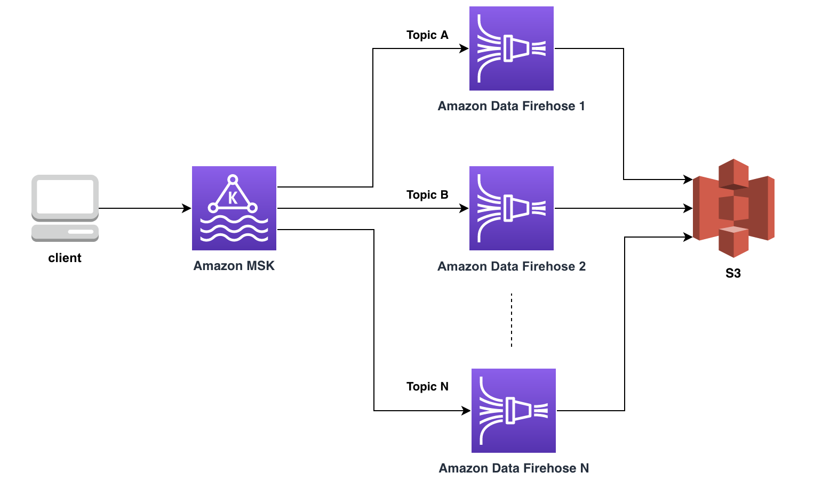

# Process multiple Amazon MSK topics via one to one mapping with Amazon Data Firehose

This repository provides you with the sample workflow and code on how to create one to one mapping between your Amazon MSK topics and Amazon Data Firehose. Amazon Data Firehose can then deliver the data to the S3 or your configured destination in near real time.

You can either provide a list of topics or a regular expression and this script will create a Data Firehose stream for each of the matching topics residing in your MSK cluster.

### Architecture


### Pre-requisites

Install the following and any other necessary packages.

```
pip install confluent_kafka
pip install boto3
pip install aws-msk-iam-sasl-signer-python
```

### Running the script

Script accepts the following system arguments :

```
./DataFirehoseDeployer.py <bootstrap-brokers> <MSK Cluster ARN> <Cluster Connectivity (PUBLIC/PRIVATE)> <S3 Bucket Name>
<options: 1 for regex, 2 for topic list> <RegEx/topic list>
```
1. bootstrap-brokers : If you are providing private bootstrap brokers then run this script form within the VPC.
2. MSK Cluster ARN
3. Cluster Connectivity (PUBLIC/PRIVATE) : Amazon Data Firehose can connect to your MSK cluster Privately or Publicly, mention the appropriate connectivity option.
4. S3 Bucket Name : S3 bucket name to which you want to deliver the Data, the script will automatically create prefixes for each topic inside this bucket.
5. options: 1 for regex, 2 for topic list : Use 1 if you are providing a regular expression, in this mode, script will find all the topics matching the RegEx, Use 2 if you are providing a list of topics, in this case script does not verify the topics in MSK.
6. RegEx/topic list : Provide either the RegEx or topic list (space seperated).